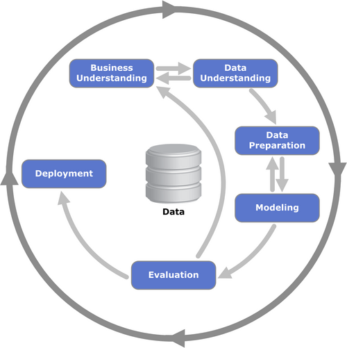

# Machine Learning Introduction

Foundations of supervised learning, model selection, and the ML workflow.

## Overview

This module establishes the conceptual and mathematical foundations of machine learning engineering.

Using the Car Fuel Efficiency dataset, I explored:
- The difference between machine learning and rule-based systems
- Core supervised learning concepts
- The CRISP-DM framework for structuring ML projects
- Model validation and selection strategies
- Linear algebra foundations for regression
- Practical environment setup for reproducible ML work

## What Is Machine Learning?

Machine learning is the process of learning patterns from data in order to make predictions on unseen examples.

Each dataset consists of:
- **Features (X)**: Descriptive attributes of objects
- **Target (y)**: The value we want to predict

The goal of training is to learn a function:

$$g(X) = y$$

Where the model approximates the mapping from features to target.

In this module, we focused on **supervised learning**, where labeled examples guide model training.

### Types of Supervised Learning
- Regression → Predicting numeric values
- Classification → Predicting categories
- Ranking → Ordering items by relevance

The Car Fuel Efficiency dataset is primarily a regression problem, since fuel efficiency is a numeric target.

## ML vs Rule-Based Systems

Traditional rule-based systems rely on manually defined logic. For example, spam detection based on keywords.

These systems:
- Require constant maintenance
- Become complex and brittle over time
- Do not generalize well

Machine learning systems instead:
1. Learn from historical data
2. Convert inputs into numerical features
3. Produce probabilistic predictions
4. Use thresholds for decision-making

This shift from explicit rules to learned patterns is foundational in modern ML systems.

## Project Framework: CRISP-DM

I structured the project using the CRISP-DM methodology. CRISP-DM stands for Cross-Industry Standard Process for Data Mining. It is a widely adopted open standard process model that provides a structured, industry-agnostic roadmap for solving data-driven problems.

The methodology breaks down analytics projects into six logical phases:

1. Business Understanding

    Define the prediction goal clearly and ensure it is measurable.

2. Data Understanding

    Explore distributions, identify missing values, understand feature structure.

3. Data Preparation

    Clean data, handle missing values, transform features into tabular form.

4. Modeling

    Train candidate models and evaluate performance.

5. Evaluation

    Assess whether the model solves the business objective.

6. Deployment

    Prepare the solution for production use.



*Figure: CRISP-DM process model (Source: Wikimedia Commons, CC BY-SA 3.0)*

Machine learning is inherently iterative. Each stage informs the next. CRISP-DM encourages iteration between phases as insights develop and priorities shift.

## Model Selection and Validation Strategy

A critical part of ML engineering is avoiding overfitting and selection bias.

Dataset split strategy:
- Training: 60%
- Validation: 20%
- Test: 20%

Workflow:
1. Train models on training data
2. Evaluate on validation data
3. Select the best candidate
4. Retrain on combined train + validation
5. Evaluate once on the test set

This guards against the **Multiple Comparisons Problem**, where one model may appear best purely by chance.

## Environment and Reproducibility

This project was implemented using:
- Python 3.12
- NumPy
- Pandas
- Scikit-Learn
- Statsmodels
- Jupyter Notebook

A dedicated Python virtual environment ensures reproducibility:

```bash
python3.12 -m venv .venv
source .venv/bin/activate

pip install numpy pandas scikit-learn statsmodels jupyter
```

Library versions can be checked using:

```python
import pandas as pd

pd.__version__
```

## Dataset Exploration: Car Fuel Efficiency

Dataset: `car_fuel_efficiency.csv`

### Dataset Size

Total records: **9704**

### Fuel Types

The dataset contains **2 distinct fuel types**.

### Regional Fuel Efficiency Comparison

To better understand performance variation across regions, I examined the maximum fuel efficiency for vehicles originating from Asia.

```python
max_fuel_efficiency = df[df['origin'] == 'Asia']['fuel_efficiency_mpg'].max()
print(round(max_fuel_efficiency, 2))
```
**Result**:

The maximum fuel efficiency is 23.76 MPG.

### Missing Values

There are **4 columns with missing values**: `num_cylinders`, `horsepower`, `acceleration`, and `num_doors`.

## Handling Missing Data

The horsepower column contained missing values.

Steps taken:
1. Compute median horsepower
2. Compute most frequent value (mode)
3. Fill missing values using the mode
4. Recalculate median

Result: The median horsepower changed from 149.0 to 152.0 after mode imputation.
This demonstrates how even simple imputation strategies can shift central tendency statistics.

## Linear Algebra Foundations

To reinforce understanding of regression mechanics, I implemented matrix operations manually.

### Dot Product

$$ u \cdot v = \sum_{i = 1}^{n} u_i v_i $$

### Matrix Multiplication

Matrix multiplication forms the backbone of linear regression computation.

### Linear Regression via Normal Equation

$$ w = (X^T X)^{-1} X^T y $$

Using:
- Vehicle weight
- Model year
- Selected subset of Asian cars

After computing:
- $X^T X$
- Its inverse
- Final weight vector $w$

**Sum of regression coefficients:** 0.519

This exercise connects linear algebra directly to model training mechanics.

## Key Technical Skills Demonstrated

- Data loading and exploration with Pandas
- Handling missing values using statistical imputation
- Vectorized numerical computation with NumPy
- Manual implementation of matrix multiplication
- Linear regression via the normal equation
- Proper dataset splitting and validation methodology
- Reproducible Python environment setup

## Core Takeaways

1. Machine learning is structured pattern extraction, not magic.
2. Validation strategy is as important as modeling.
3. Linear algebra underpins regression models.
4. Clean environments enable reproducibility.
5. ML engineering begins long before deployment.

This module establishes the conceptual rigor needed for scaling from notebook experiments to production ML systems.